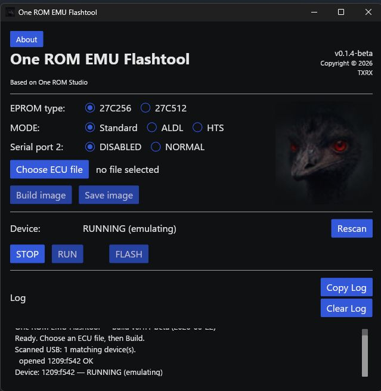

# Ostrich-compatible protocol serial emulation device for One ROM EMU flashtool

    One ROM EMU Flashtool for Fire 28 (A or B)

    Flashes a custom Ostrich-compatible protocol serial emulator on a One ROM Fire 28 for realtime ECU/PCM tuning. 
    Compatible with TunerPro RT. 
    Released as is, where is. 
    For off-road use only.

    Bank switching is disabled, UART uses the One ROM SELA and SELB pins.

    

    <b>Choose Eprom type.</b>

    <b>Serial Port 2:</b> NORMAL 38400 8N1 / DISABLED / ALDL 8192 8N1 / HTS.

    <b>Select .bin file.</b>

    <b>Build image.</b>

    <b>STOP</b> (If OneROM is running, Should auto detect but may need to press Rescan).

    <b>FLASH</b>

    <b>RUN</b> the Emu.

     
    Emus can run up to 50 km/h (31 mph).

    Once uploaded with this firmware use TunerPro RT to edit/upload different tunes. 
    Only need to use the flashtool to change Eprom type or 2nd COM port settings after initial flashtool use.

    Information about the original One ROM Project can be found here 
    https://onerom.org/ or https://github.com/piersfinlayson/one-rom

