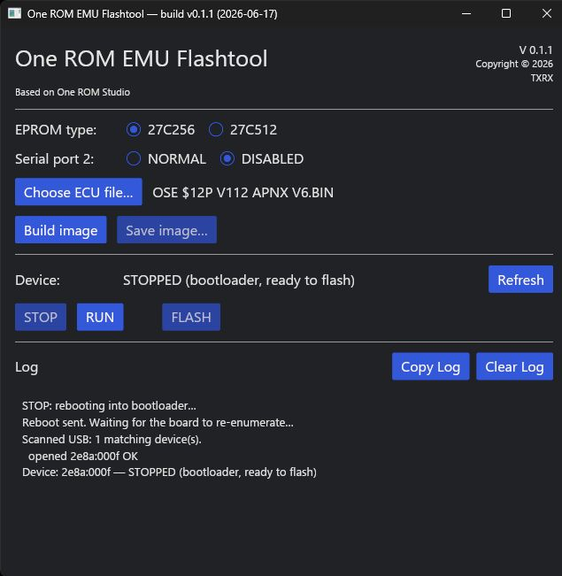

# Ostrich-compatible protocol serial emulation device for One ROM flashtool
 
One ROM EMU Flashtool for Fire 28 (A or B)

Flashes a custom Ostrich-compatible protocol serial emulator on to a One ROM Fire 28 for realtime ECU/PCM tuning and compatible with TunerPro RT. 
Released as is, where is.

    

 
Choose Eprom type.

Serial Port 2: NORMAL is enabled 115200 8N1 or Disabled (Use DISABLED for GM/Holden).

Select .bin file.

Build image.

STOP (If OneROM is running, Should auto detect but may need to press Refresh).

FLASH

RUN starts the Emu.

    

